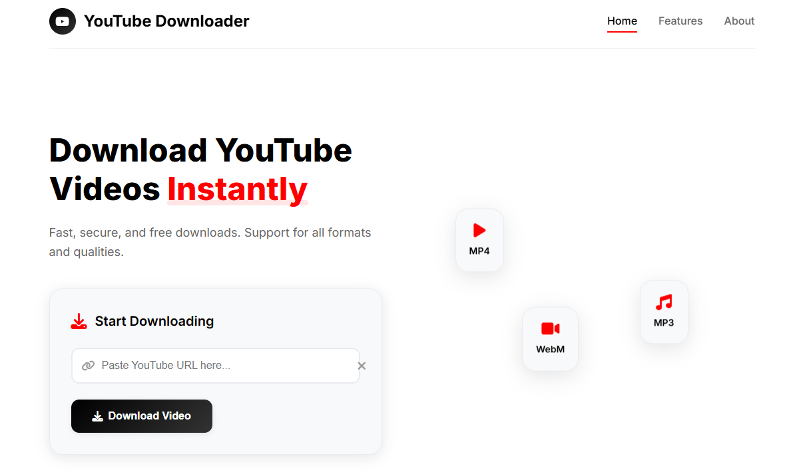

# YouTube Downloader Pro



A clean, modern web app to download YouTube videos instantly. Built with Flask (Python), yt-dlp, and a beautiful responsive frontend.

---

## Features
- Download YouTube videos in MP4 format
- Clean, modern, and mobile-friendly UI
- Download videos with their original YouTube title
- Progress and error modals for great UX
- No ads, no malware, 100% safe
- **About Section:**
  - Name: Shiv Sahani
  - Age: 19
  - Status: Student
  - Location: Mumbai, India

---

## Screenshots

> 

---

## Getting Started

### 1. Clone the repository
```sh
git clone https://github.com/ShivSahani18/youtube-downloader-pro.git
cd youtube-downloader-pro
```

### 2. Install dependencies
```sh
pip install -r requirements.txt
```

### 3. (Recommended) Install FFmpeg
- Download from: https://www.gyan.dev/ffmpeg/builds/
- Extract and add the `bin` folder to your system PATH.
- Check with:
  ```sh
  ffmpeg -version
  ```

### 4. Run the server
```sh
python server.py
```

### 5. Open in your browser
Go to: [http://127.0.0.1:5000/](http://127.0.0.1:5000/)

---

## Usage
1. Paste a YouTube video URL.
2. Click **Download Video**.
3. Wait for processing, then download your file with the original title.

---

## Project Structure
```
├── downloads/           # Downloaded videos (auto-created, gitignored)
├── index.html           # Main frontend
├── styles.css           # CSS styles
├── script.js            # Frontend JS
├── server.py            # Flask backend
├── requirements.txt     # Python dependencies
├── README.md            # This file
├── .gitignore           # Git ignore rules
```

---

## Contributing
Pull requests are welcome! For major changes, please open an issue first to discuss what you would like to change.

---

## License
This project is for educational purposes only. Please respect YouTube's Terms of Service. 